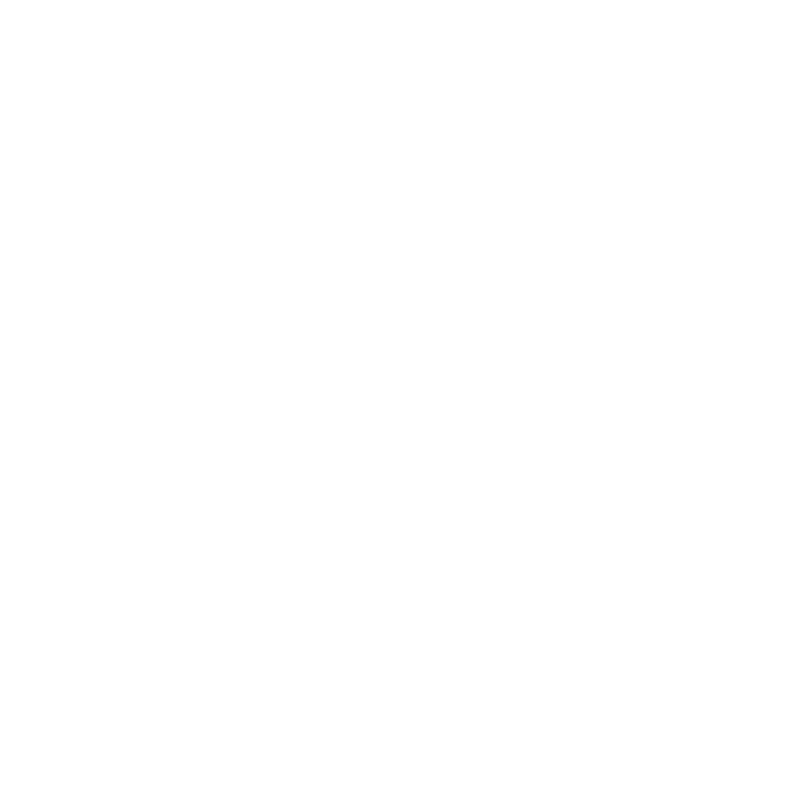

<h2 id="macropower-tech">About Me</h2>

- Studying Systems Design Engineering at the University of Waterloo  
- Passionate about the full product development cycle — from ideation to deployment  
- Thrive in collaborative environments building impactful, real-world solutions  
- Developed full-scale web apps for children with disabilities  
- Experienced in engineering scalable microservices and full-stack systems  
- Currently exploring backend programming, machine learning, autonomous vehicles, and robotics  
- Working on **estia** — a centralized platform for coding side projects and developer communities  

<h2 id="macropower-tech">Favorite Tech</h2>

`Tools, languages, and other things that I like to work with.`

<table>
  <tr>
    <td align="center" width="96">
      
       NextJS
    </td>
    <td align="center" width="96">
      
       Mongo
    </td>
    <td align="center" width="96">
      
       TypeScript
    </td>
    <td align="center" width="96">
      
       NodeJS
    </td>
    <td align="center" width="96">
      
       Kubernetes
    </td>
    <td align="center" width="96"> 
      
       Docker
    </td>
    <td align="center"  width="96">
      
       Azure
    </td>
    <td align="center" width="96">
      
       Angular
    </td>
  </tr>
</table>

<h2 id="macropower-tech">Socials</h2>

`Check me out or contact me in these places`

 

 

###

 

###
