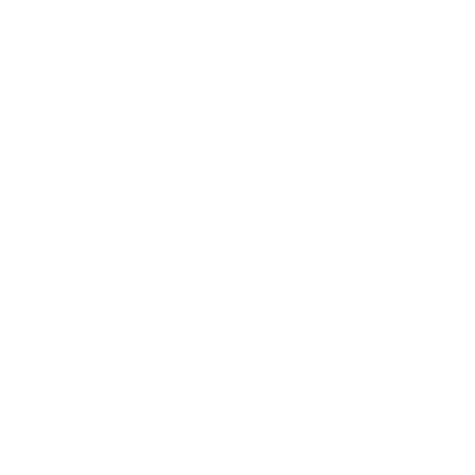
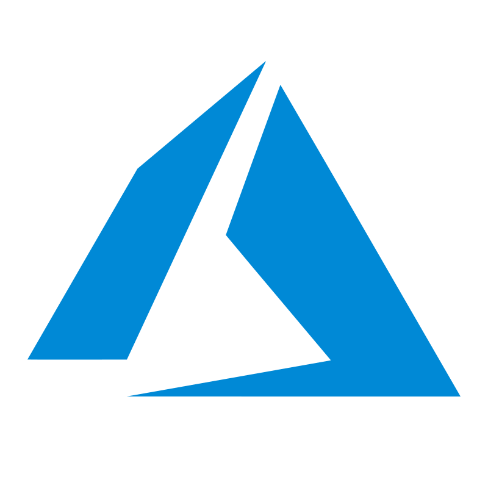

<h2 id="macropower-tech">About me</h2>

Seeking Fall 2026 Internships!

→ Studying [Systems Design Engineering](https://uwaterloo.ca/future-students/programs/systems-design-engineering) at the University of Waterloo  
→ Previously interned at [Spellbook](https://www.spellbook.legal/) (Khosla Ventures) building AI agents for legal workflows 
→ Passionate about the full product development cycle ~ from ideation to deployment 
→ Building a volunteer & route management platform for [Beach Metro Community News](https://www.beachmetro.com/) @ UW Blueprint 
→ Building [**UW Wiki**](https://github.com/suryajj/uw-wiki) — a student-edited knowledge base for UW clubs, design teams, and programs 
→ Currently exploring AI agent architectures and full-stack engineering 

<h2 id="macropower-tech">Favorite tech</h2>

`Tools, languages, and other things that I like to work with.`

<table>
  <tr>
    <td align="center" width="96">
      
       NextJS
    </td>
    <td align="center" width="96">
      
       TypeScript
    </td>
        <td align="center" width="96">
      
       PostgreSQL
    </td>
        <td align="center" width="96">
      
       AWS
    </td>
    <td align="center" width="96">
      
       NodeJS
    </td>
    <td align="center" width="96"> 
      
       Docker
    </td>
    <td align="center" width="96">
      
       Mongo
    </td>
    <td align="center"  width="96">
      
       Azure
    </td>
  </tr>
</table>
