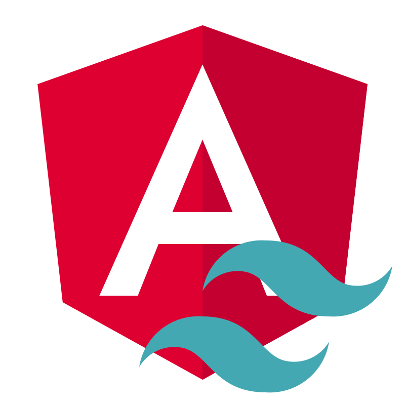

  

 

✰✰✰✰✰✰✰✰✰✰✰✰✰✰✰✰✰✰✰✰✰✰✰✰✰✰✰✰✰✰✰✰✰✰✰✰✰✰✰✰✰✰✰✰✰✰✰✰✰✰✰✰✰✰✰✰✰✰✰✰✰✰✰✰✰✰✰✰

## 👋About Me
Hey, my name is Abeer and currently I'm studying Systems Design Engineering at the University of Waterloo! I’m passionate about the entire product development journey, from start to finish, and lately, I’ve been particularly fascinated by machine learning ⚙️, blockchain 🧾, and backend programming 💻

🌱 Currently I am working on a patient record web app for doctors that uses blockchain for safe transactions

##

<!--

  

-->

###

###

<h2 align="left" id="macropower-tech">👨‍💻Favorite Tech</h2>

> Tools, languages, and other things that I like to work with.

<table>
  <tr>
    <td align="center" width="96">
      
       NextJS
    </td>
    <td align="center" width="96">
      
       Mongo
    </td>
    <td align="center" width="96">
      
       TypeScript
    </td>
    <td align="center" width="96">
      
       NodeJS
    </td>
    <td align="center" width="96">
      
       Kubernetes
    </td>
    <td align="center" width="96"> 
      
       Docker
    </td>
    <td align="center"  width="96">
      
       Azure
    </td>
    <td align="center" width="96">
      
       Angular
    </td>
  </tr>
</table>

## 🏋️Socials
> Check me out or contact me in these places

 

 
  

  

###

 

<!---

-->

###
